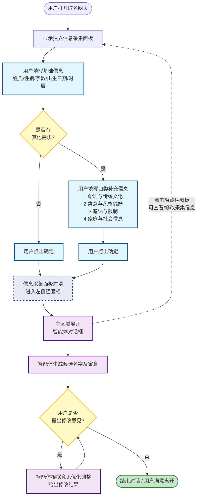
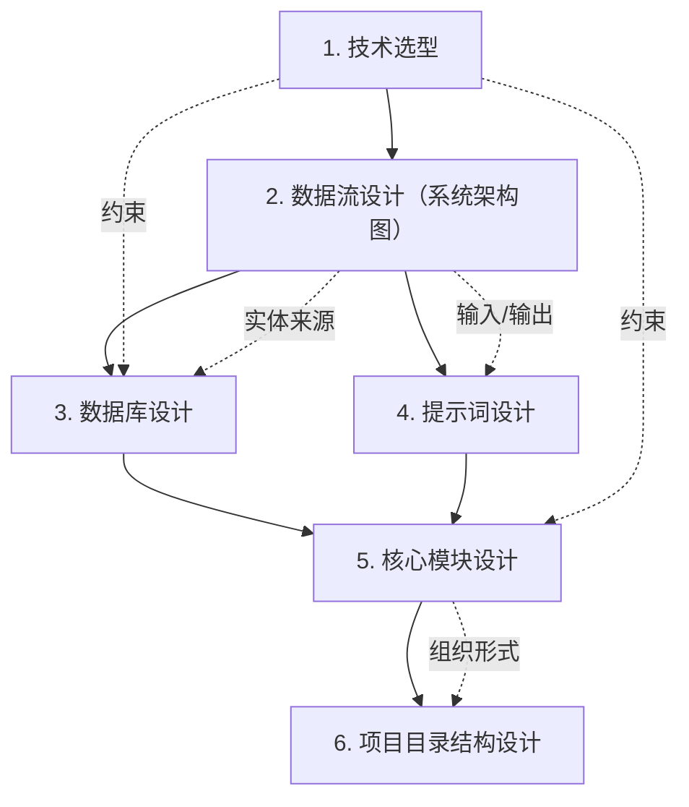
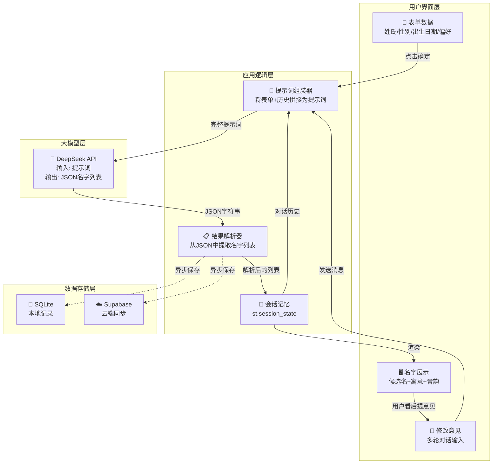
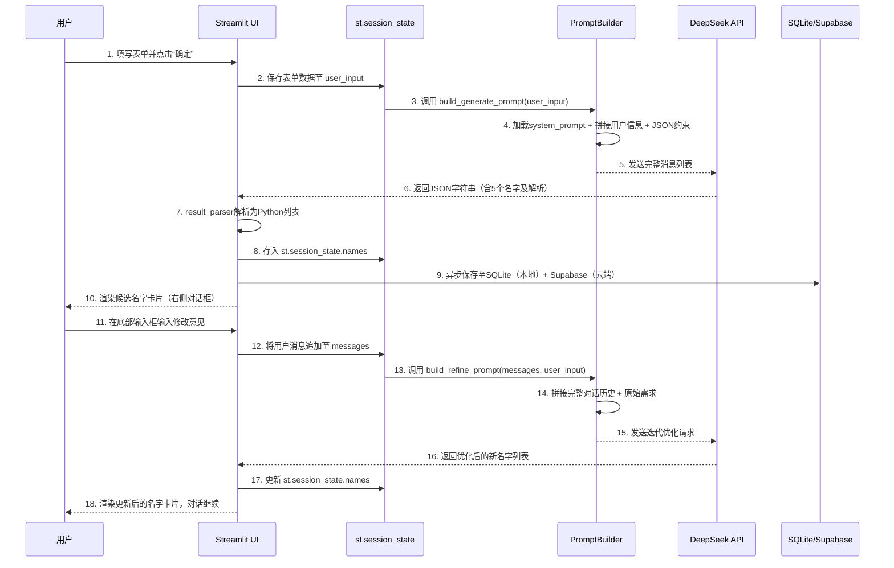

一、大语言模型取名系统的调研（取一个名字需要关注什么方面）
1. 基础信息类 姓氏 性别 名字字数
2. 出生信息类 出生日期 出生时辰 出生地点
3. 命理与传统文化类 生辰八字 五行偏好 生肖属相 字辈/族谱 三才五格
4. 寓意与风格偏好类 寓意方向 取名风格 典籍来源偏好 诗词典故 星座特质
5. 避讳与限制类 避讳字 避讳人名 禁用字 避免重名
6. 家庭与社会信息类 父亲姓名 母亲姓名 祖上姓名

二、业务流程
整体以双区域交互形式展开，用户打开取名网页后，左侧独立信息采集面板展开，供用户填写姓氏、性别、字数、出生日期等基础信息，并选择是否有其他需求——若选择“无”，直接点击确定即可；若选择“有”，面板动态展开四类补充信息区域（命理与传统文化、寓意与风格偏好、避讳与限制、家庭与社会信息），填写完成后点击确定。用户点击确定后，信息采集面板向左滑入页面左侧的隐藏栏中，主区域同步展开为智能体对话框，系统自动生成候选名字及寓意解析。后续用户可在对话框中提出修改意见，系统结合上下文记忆进行多轮优化调整，反复迭代直至用户满意结束对话；对话过程中，用户亦可随时点击左侧隐藏栏展开采集面板，查看或修改初始信息。

三、UI界面
整体界面采用“左侧信息采集面板 + 右侧智能体对话框”的双区域布局设计，用户打开网页后，左侧独立的采集面板展开显示，清晰分区呈现基础信息输入区（姓氏、性别、字数、出生日期、时辰）和可动态展开的补充信息区（命理与文化、寓意风格、避讳限制、家庭社会信息），所有表单项均配有明确的标签和示例占位符，底部为突出的“确定/开始取名”按钮；右侧主区域初始展示引导语，待用户点击确定后，左侧面板向左平滑滑入窄条隐藏栏（仅保留“☰ 信息采集”图标），主区域无缝切换为对话界面，自上而下依次展示智能体头像与消息气泡（含候选名字卡片及字义、音韵、出处等详细解析）、用户反馈消息气泡，以及底部固定的文本输入框和发送按钮，整体采用新中式极简风格，以暖白背景搭配朱砂红与淡金点缀，兼顾文化温度与清晰的信息层级。

渲染图

四、技术方案

设计流程

1.技术选型（选择什么技术）

| 技术层级         | 我的最终选型                 | 决策依据                                                     |
| :--------------- | :--------------------------- | :----------------------------------------------------------- |
| **开发语言**     | **Python 3.9+**              | 语法简洁，大模型生态（AI库）最成熟，项目代码量少，适合快速迭代。 |
| **前端界面**     | **Streamlit**                | **关键决策**：纯Python生成网页，无需学前端三件套。自带侧边栏(`st.sidebar`)和聊天组件(`st.chat_input`)，完美对应“左面板+右对话”设计。 |
| **大语言模型**   | **DeepSeek API**（在线）     | 注册即送500万tokens免费额度；中文取名逻辑稳定；API调用仅需3行代码。**不选本地模型**：因为需GPU显存≥6GB，学生电脑跑不动。 |
| **本地数据库**   | **SQLite**                   | Python内置`sqlite3`模块，**零配置、零安装**，一个文件就是一个库。适合项目初期练手SQL语句。 |
| **云数据库**     | **Supabase**                 | 老师明确推荐。提供免费500MB空间，带可视化后台管理界面，无需自己搭建云服务器。 |
| **会话状态管理** | **st.session_state**（内存） | Streamlit内置功能，一行代码存数据，不用额外安装Redis。项目关闭数据自动释放，足够MVP演示。 |
| **代码管理**     | **Git + GitHub**             | 防代码丢失，便于展示版本迭代过程（课程报告可截图提交记录）。 |

2.（这些技术怎么搭配干活）

​		1.数据流
（精简版）

（详细版）

3.数据库设计（难度1）

本项目的数据库设计已从初步的3张表方案（NAMING_RECORDS + CHARACTER_USAGE + CLOUD_SYNC）
完善为更适合难度1~3的分表方案。

**难度1** 只需要3张核心表：

| 表名 | 作用 |
|:---|:---|
| `naming_sessions` | 记录每次取名会话的用户输入信息 |
| `candidate_names` | 记录AI生成的每个候选名字及解析 |
| `conversation_messages` | 记录用户和AI的多轮对话历史 |

详细的表结构、字段说明、DDL语句、Python操作代码 → 见 **[技术方案.md](./技术方案.md#二数据库设计)**

难度2/3需要的用户表、计费表等也在技术方案.md中有完整设计（后续扩展时使用）。