一、大语言模型取名系统的调研（取一个名字需要关注什么方面）
1. 基础信息类 姓氏 性别 名字字数
2. 出生信息类 出生日期 出生时辰 出生地点
3. 命理与传统文化类 生辰八字 五行偏好 生肖属相 字辈/族谱 三才五格
4. 寓意与风格偏好类 寓意方向 取名风格 典籍来源偏好 诗词典故 星座特质
5. 避讳与限制类 避讳字 避讳人名 禁用字 避免重名
6. 家庭与社会信息类 父亲姓名 母亲姓名 祖上姓名

二、业务流程

1.注册流程

注册流程从用户进入登录页开始。若用户尚未注册，可点击“注册”按钮跳转至注册页，填写邮箱、密码及确认密码。点击“注册”按钮后，系统对填写信息进行校验：邮箱格式是否正确、密码强度是否足够（至少8位，含大小写字母和数字）、两次密码是否一致、邮箱是否已被注册。若校验失败，页面显示相应错误提示，用户修正后重新提交。校验通过后，系统直接完成注册，提示注册成功并自动跳转至登录页，用户即可使用注册的账号登录系统。

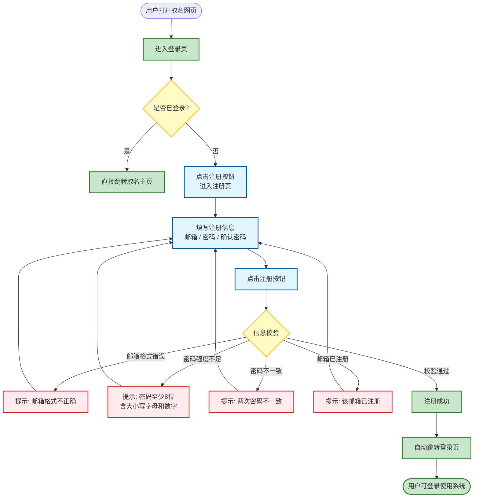


2.取名流程

取名流程是系统的核心业务流程。用户登录成功后，首先进入取名主页，页面左侧展示独立的信息采集面板。用户依次填写基础信息（姓氏、性别、字数、出生日期、时辰），并根据需求选择是否需要补充四类深度信息（命理与传统文化、寓意与风格偏好、避讳与限制、家庭与社会信息）。点击“确定”按钮后，系统首先校验用户账户剩余生成次数是否充足（每次生成消耗1次）。若次数不足，弹窗提示并引导用户跳转至充值页面；若次数充足，系统扣除1次次数，采集面板向左滑入隐藏栏，主区域切换为智能体对话框。系统自动调用大语言模型生成不少于5个候选名字及完整解析（含字义、寓意、音韵、典籍出处、五行适配），结果以卡片形式展示，并自动保存至本地SQLite数据库和云端Supabase。

用户查看候选名字后，若满意即可结束对话；若不满意，可在底部输入框中提出修改意见。每次修改意见提交前，系统同样校验剩余次数——若次数不足则引导充值，若充足则扣除次数并调用大模型，结合对话上下文进行优化调整，生成新的候选名字并再次保存至数据库。用户可反复进行多轮迭代，直至满意结束。整个流程中，用户可随时点击左侧隐藏栏按钮展开采集面板，查看或修改初始信息。

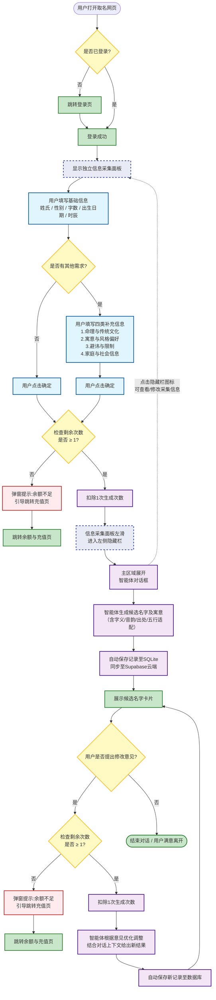


3.充值流程

充值流程支持三种入口方式：用户可从取名主页导航栏进入个人中心后点击余额表单进入充值页面；或在使用过程中若余额不足，系统弹窗提示并直接引导至充值页面；也可在个人中心主动点击“查看消费记录”进入。充值页面展示当前余额及消费记录，用户可选择预设档位（10次/¥5.00、30次/¥12.00、100次/¥35.00）或输入自定义金额，点击“立即充值”后跳转至支付页面，支持支付宝、微信支付和银行卡三种支付方式。系统展示支付二维码或跳转至对应支付App，用户完成扫码支付后，系统通过支付回调确认结果。若支付成功，系统异步更新用户余额并记录充值流水；若用户取消或支付超时，提示支付失败并可重新选择档位。充值成功后，用户可选择返回取名主页继续使用，或留在余额页面查看更新后的余额和充值记录。

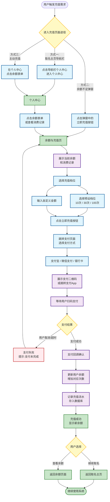


三、UI布局与状态映射/用户界面导航与交互概述

```
整体界面采用“左侧信息采集面板 + 右侧智能体对话框”的双区域布局设计，用户打开网页后，左侧独立的采集面板展开显示，清晰分区呈现基础信息输入区（姓氏、性别、字数、出生日期、时辰）和可动态展开的补充信息区（命理与文化、寓意风格、避讳限制、家庭社会信息），所有表单项均配有明确的标签和示例占位符，底部为突出的“确定/开始取名”按钮；右侧主区域初始展示引导语，待用户点击确定后，左侧面板向左平滑滑入窄条隐藏栏（仅保留“☰ 信息采集”图标），主区域无缝切换为对话界面，自上而下依次展示智能体头像与消息气泡（含候选名字卡片及字义、音韵、出处等详细解析）、用户反馈消息气泡，以及底部固定的文本输入框和发送按钮，整体采用新中式极简风格，以暖白背景搭配朱砂红与淡金点缀，兼顾文化温度与清晰的信息层级。
```

渲染图


1.页面结构总图

```h'm
├── 登录页 /login
├── 注册页 /register
├── 主页面 / (需登录)
│   ├── 取名主页 /generate
│   ├── AI评价名字 /evaluate
│   ├── 历史记录页 /history
│   └── 个人中心 /profile
│       ├── 余额与充值 /profile/balance
│       └── 修改密码 /profile/password
```

2.页面功能说明表

| 字段         | 说明                                                         |
| :----------- | :----------------------------------------------------------- |
| **页面名称** | 登录页                                                       |
| **路由**     | `login`                                                      |
| **页面用途** | 账户登录                                                     |
| **主要组件** | 邮箱输入框，密码输入框，登录确认按钮，注册账户按钮，密码可见按钮 |
| **可见条件** | 未登录状态可见                                               |
| **关联状态** | 初始态、登录失败态、登录成功态、密码不可见态、密码可见态、异常态（包括空结果） |


| 字段         | 说明                                                         |
| :----------- | :----------------------------------------------------------- |
| **页面名称** | 注册页                                                       |
| **路由**     | `register`                                                   |
| **页面用途** | 账户注册                                                     |
| **主要组件** | 邮箱输入框，密码输入框，确认密码输入框，注册确认按钮，返回登录按钮，密码强度评估条 |
| **可见条件** | 未登录状态可见                                               |
| **关联状态** | 初始态、注册失败态（账户已存在）、注册成功态                 |


| 字段         | 说明                                                         |
| :----------- | :----------------------------------------------------------- |
| **页面名称** | 取名主页                                                     |
| **路由**     | `/generate`                                                  |
| **页面用途** | 填写取名需求，查看生成结果，进行多轮对话优化                 |
| **主要组件** | 表单区（姓氏、性别、生日、期望…）、生成按钮、结果卡片列表、追问输入框，个人中心按钮，历史记录按钮，左侧隐藏栏按钮 |
| **可见条件** | 必须登录；若未登录，路由守卫自动跳转 `/login`                |
| **关联状态** | 初始态、加载态、成功态、空结果态、异常态（包括余额不足）     |


| 字段         | 说明                                                         |
| :----------- | :----------------------------------------------------------- |
| **页面名称** | AI评价名字                                                   |
| **路由**     | `/evaluate`                                                  |
| **页面用途** | 输入名字，AI进行多维度评价打分                                |
| **主要组件** | 名字输入框、评价按钮、结果卡片（总分+维度评分+评语）、评价历史列表 |
| **可见条件** | 必须登录；若未登录，路由守卫自动跳转 `/login`                |
| **关联状态** | 初始态（等待输入）、加载态（AI分析中）、成功态（展示评价）、异常态（余额不足/AI不可用） |


| 字段         | 说明                                                       |
| :----------- | :--------------------------------------------------------- |
| **页面名称** | 历史记录页                                                 |
| **路由**     | `history`                                                  |
| **页面用途** | 查看取名历史、搜索、评分筛选、收藏管理、用户打分           |
| **主要组件** | 搜索框、收藏筛选、评分筛选下拉框、会话expander、名字双层expander（标签→详情+评分星标+备注） |
| **可见条件** | 必须登录；若未登录，路由守卫自动跳转 `/login`              |
| **关联状态** | 初始态、搜索成功态、搜索失败态、异常态（包括历史记录为空） |


| 字段         | 说明                                                         |
| :----------- | :----------------------------------------------------------- |
| **页面名称** | 个人中心                                                     |
| **路由**     | `profile`                                                    |
| **页面用途** | 展示和修改用户个人信息                                       |
| **主要组件** | 用户信息框（邮箱，头像），余额表单，充值按钮，修改密码按钮，退出登录按钮，返回按钮，注销账户，查看消费记录按钮 |
| **可见条件** | 必须登录；若未登录，路由守卫自动跳转 `/login`                |
| **关联状态** | 初始态、注销确认态、退出登录确认态，异常态                   |


| 字段         | 说明                                          |
| :----------- | :-------------------------------------------- |
| **页面名称** | 余额与充值                                    |
| **路由**     | `/profile/balance`                            |
| **页面用途** | 展示用户余额，流水记录，充值账户              |
| **主要组件** | 余额表单，消费记录表，充值框，返回按钮        |
| **可见条件** | 必须登录；若未登录，路由守卫自动跳转 `/login` |
| **关联状态** | 初始态、充值成功态、充值失败态、异常态        |


| 字段         | 说明                                                     |
| :----------- | :------------------------------------------------------- |
| **页面名称** | 修改密码                                                 |
| **路由**     | `/profile/password`                                      |
| **页面用途** | 修改密码                                                 |
| **主要组件** | 当前密码输入框，新密码输入框，确认新密码输入框，返回按钮 |
| **可见条件** | 必须登录；若未登录，路由守卫自动跳转 `/login`            |
| **关联状态** | 初始态、修改成功态、修改失败态、异常态                   |


3.ui布局

**整体风格：**

- **主题**：新中式极简风格（Modern Chinese Aesthetics）融合 SaaS 干净UI
- **色彩方案**：
  - 主背景：暖白色 `#F9F7F4`
  - 卡片/容器背景：纯白 `#FFFFFF`，带柔和阴影
  - 主色调：朱砂红 `#C43D3D`（按钮、Logo、强调色）
  - 辅助色：淡金 `#D4AF37`（点缀、边框、高亮）
  - 主文字：墨黑 `#2C2C2C`
  - 辅助文字：灰色 `#8C8C8C`
  - 表单边框：浅灰 `#E5E0D8`
- **字体**：
  - UI文字：PingFang SC / Inter（无衬线体）
  - 名字展示：思源宋体 / Noto Serif SC（优雅衬线体）
- **质感**：轻微毛玻璃效果（glassmorphism）、柔和阴影、圆角适中（8-12px）
- **氛围**：温暖、专业、舒缓，婴儿般的柔和光线

**顶部导航栏统一设计（登录/注册页除外）：**

- 位于页面最顶部，高度约64px，背景为纯白 `#FFFFFF`，底部有1px浅灰分割线
- 左侧：品牌Logo + 系统名称“智能取名系统”
- 右侧：依次排列——**”取名主页”** 按钮、**”AI评价”** 按钮、**”历史记录”** 按钮、**”个人中心”** 按钮（显示用户头像，若无头像则显示首字母圆标）
- 右侧额外区域：**“余额”** 标签（显示当前余额/剩余次数，如“余额：12次”），**“退出登录”** 按钮（文字按钮，红色提示）
- 高亮当前所在页面（如当前为取名主页，则“取名主页”按钮为朱砂红文字，其余为灰色）
- 交互反馈：鼠标悬停时按钮文字颜色变深，点击时轻微缩放效果


登录页

```
一张高保真网页UI设计图，展示一个名为“智能取名系统”的AI取名工具的登录页面。

页面采用居中卡片布局，背景为暖白色。卡片为纯白色，带柔和阴影，位于屏幕正中央。卡片顶部有一个朱砂红色的中式印章风格Logo，旁边是系统名称“智能取名系统”，使用优雅的中文衬线字体。标题下方有一行灰色小字“登录您的账户”。

卡片内部包含两个输入框：邮箱输入框（带用户图标占位符，显示灰色文字“请输入邮箱地址”）和密码输入框（带锁图标占位符，显示灰色文字“请输入密码”，右侧有一个小眼睛图标用于切换密码可见性）。密码框下方，左侧有一个“记住我”复选框。

一个醒目的朱砂红色按钮横跨卡片宽度，白色文字显示“登 录”。按钮下方有一行文字“还没有账号？立即注册”，其中“立即注册”为朱砂红色。

整体风格为新中式美学与现代SaaS设计结合，暖色工作室灯光，8K超高清，写实风格。 --ar 16:9
```

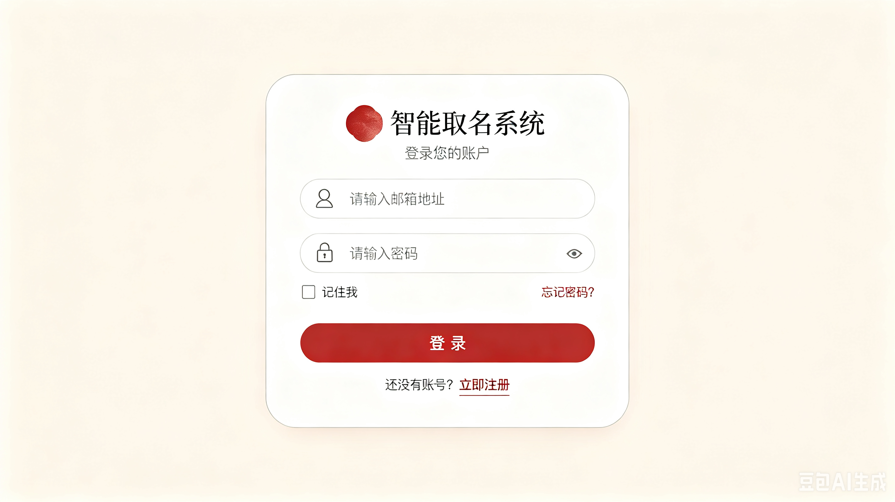

注册页

```
一张高保真网页UI设计图，展示一个名为“智能取名系统”的AI取名工具的注册页面。

页面采用居中卡片布局，背景为暖白色。卡片为纯白色，带柔和阴影。卡片顶部有一个朱砂红色的Logo和系统名称“智能取名系统”。标题下方有一行灰色小字“创建新账户”。

卡片内部包含三个输入框：邮箱输入框（占位符“请输入邮箱地址”）、密码输入框（占位符“请设置密码”，下方有一条密码强度指示条，显示弱/中/强三段颜色）、确认密码输入框（占位符“请再次输入密码”）。

底部是一个横跨卡片宽度的朱砂红色按钮，白色文字显示“注 册”。按钮下方有文字“已有账号？返回登录”，其中“返回登录”为朱砂红色。

整体风格为新中式美学，暖色调，8K超高清，写实风格。 --ar 16:9
```

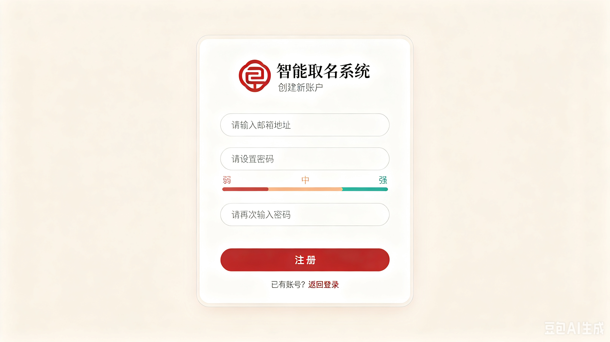


取名主页

```
一张高保真网页UI设计图，展示一个名为“智能取名系统”的AI取名工具的主页面，采用双区域布局。

整体界面采用“左侧信息采集面板 + 右侧智能体对话框 + 顶部导航栏”的三区域布局设计，页面顶部有一行导航栏（高度64px），左侧显示品牌Logo和“智能取名系统”，右侧依次排列导航链接：“取名主页”（朱砂红色高亮）、“历史记录”、一个余额标签“余额：12次”，以及“个人中心”（带圆形用户头像显示首字母）和红色的“退出登录”文字按钮。

主区域分为左右两个面板：
- 左侧面板（展开状态）：暖白色的信息采集侧边栏，标题为“📝 宝宝信息”。表单字段垂直排列：姓氏输入框（占位符“林”）、性别切换按钮（男孩/女孩）、名字字数下拉框（单字/双字/三字及以上）、出生日期选择器、出生时辰下拉框。下方是一个可折叠区域“是否有其他需求？”，包含四个分类复选框：命理与文化、寓意与风格、避讳与限制、家庭与社会信息。面板底部是一个醒目的朱砂红色按钮“🎯 确定 / 开始取名”。
- 右侧面板：干净的对话式界面，左侧有AI头像（可爱吉祥物），显示欢迎消息气泡：“请填写左侧信息，我将为您智能取名”。底部有固定的输入栏，占位符文字为“说出您的修改意见...”，右侧有一个朱砂红色的发送箭头按钮。

左侧面板边缘有一个向左的箭头提示，表示可以滑动折叠。整体风格为新中式美学，暖白背景，朱砂红点缀，淡金高光，柔和阴影，8K超高清写实风格。 --ar 16:9
```

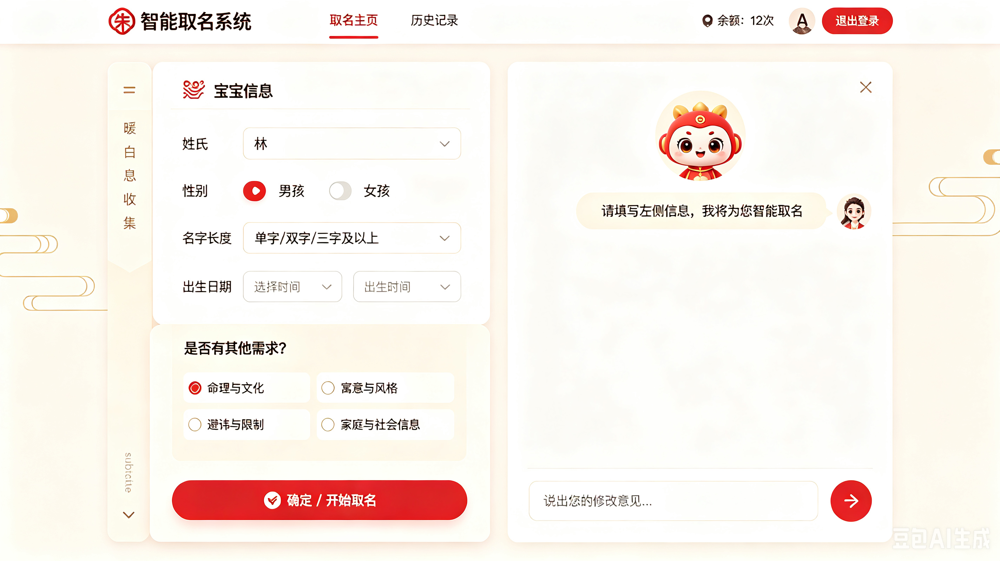

历史记录页

```
一张高保真网页UI设计图，展示一个名为“智能取名系统”的AI取名工具的历史记录页面。

页面顶部有一行导航栏，左侧显示品牌Logo和“智能取名系统”，右侧依次排列导航链接：“取名主页”、“历史记录”（朱砂红色高亮）、“个人中心”（带圆形用户头像），以及余额标签“余额：12次”和红色的“退出登录”文字按钮。

导航栏下方是主要内容区域：
- 一行搜索栏：左侧是搜索输入框（占位符“搜索姓氏或名字...”），右侧是朱砂红色的搜索按钮，以及一个灰色筛选切换按钮“⭐ 仅看收藏”。
- 垂直排列的历史记录卡片列表。每张卡片显示：时间戳“2026-07-03 14:28”、姓氏和性别标签“林 · 女孩”、生成的名字行“林疏桐 · 林望舒 · 林知微”，以及右侧的操作按钮：“查看详情”（文字链接）和空心星标收藏按钮（已收藏的显示金色填充星标）。
- 顶部的卡片带有“⭐ 收藏”徽章。

背景为暖白色，卡片为纯白色带柔和阴影。整体风格为新中式美学，简洁清晰，8K超高清写实风格。 --ar 16:9
```

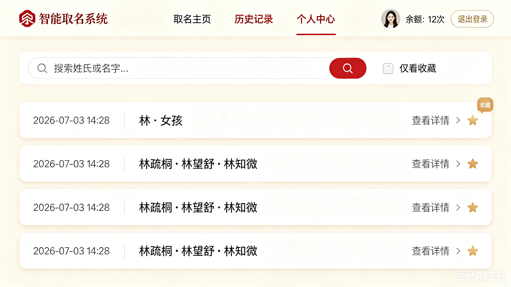


个人中心

```
一张高保真网页UI设计图，展示一个名为“智能取名系统”的AI取名工具的个人中心页面。

页面顶部有一行导航栏，左侧显示品牌Logo和“智能取名系统”，右侧依次排列导航链接：“取名主页”、“历史记录”、“个人中心”（朱砂红色高亮，带圆形用户头像），以及余额标签“余额：12次”和红色的“退出登录”文字按钮。

导航栏下方，主要内容以卡片网格排列：
- 左侧是一张用户信息卡片：显示大尺寸圆形头像（含用户首字母）、邮箱地址“user@email.com”、账户创建日期“注册于：2026-01-01”。
- 右侧是一张余额卡片：显示“💰 当前余额”大数字“12”和单位“次”，一个朱砂红色的“立即充值”按钮，下方有灰色小字“查看消费记录”。
- 下方是一行操作卡片：“🔑 修改密码”卡片、“🚪 退出登录”卡片（带红色警告色调）、“⚠️ 注销账户”卡片（带红色边框警告样式）。

所有卡片为纯白色带柔和阴影，背景为暖白色。整体风格为新中式美学，卡片布局清晰，8K超高清写实风格。 --ar 16:9
```

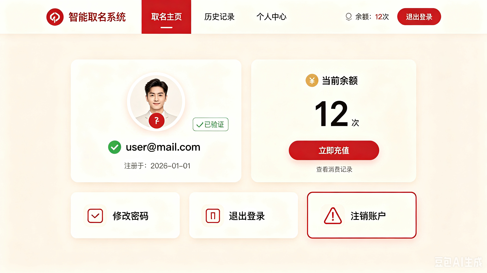


余额与充值

```
一张高保真网页UI设计图，展示一个名为“智能取名系统”的AI取名工具的余额与充值页面，这是个人中心的子页面。

页面顶部有一行导航栏，左侧显示品牌Logo和“智能取名系统”，右侧依次排列导航链接：“取名主页”、“历史记录”、“个人中心”（带圆形用户头像），以及余额标签“余额：12次”和红色的“退出登录”文字按钮。

导航栏下方，内容区域左上角显示返回按钮“← 返回个人中心”（灰色文字）。

主要内容包括：
- 一张大尺寸余额展示卡片：“💰 当前余额”大数字“12”和单位“次”，下方小字“1次 = 1次取名生成”。
- 充值区域：一行三个预设充值档位按钮——“10次”（¥5.00）、“30次”（¥12.00，带金色“推荐”徽章）、“100次”（¥35.00，带金色“超值”徽章），以及一个自定义金额输入框（带¥前缀）。下方是朱砂红色的“立即充值”按钮。
- 下方的消费记录表格：列包含日期、描述（如“AI取名生成”）、变动金额（如“-1次”红色或“+30次”绿色）、剩余余额。

背景为暖白色，卡片为纯白色带柔和阴影。整体风格为新中式美学，简洁的财务看板风格，8K超高清写实风格。 --ar 16:9
```

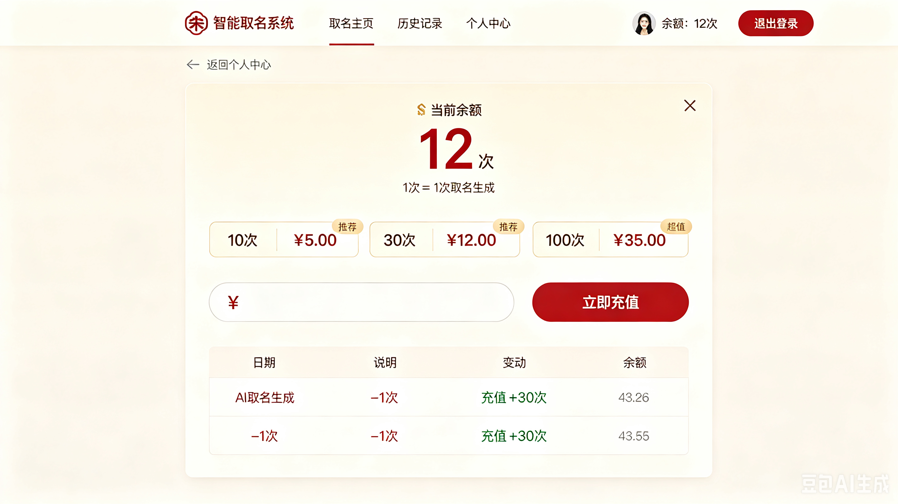


修改密码

```
一张高保真网页UI设计图，展示一个名为“智能取名系统”的AI取名工具的修改密码页面，这是个人中心的子页面。

页面顶部有一行导航栏，左侧显示品牌Logo和“智能取名系统”，右侧依次排列导航链接：“取名主页”、“历史记录”、“个人中心”（带圆形用户头像），以及余额标签“余额：12次”和红色的“退出登录”文字按钮。

导航栏下方，内容区域左上角显示返回按钮“← 返回个人中心”（灰色文字）。

主要内容是一张居中紧凑的卡片：
- 卡片标题：“🔑 修改密码”（朱砂红色）。
- 垂直排列的三个密码输入框：“当前密码”（占位符“请输入当前密码”）、“新密码”（占位符“请设置新密码”，下方有一条密码强度指示条显示弱/中/强）、“确认新密码”（占位符“请再次输入新密码”）。
- 一个朱砂红色的“确认修改”按钮（横跨卡片宽度），下方有灰色“取消”文字链接。

卡片为纯白色带柔和阴影，居中于暖白色背景。整体风格为新中式美学，简洁聚焦，8K超高清写实风格。 --ar 16:9
```


4.页面跳转逻辑

登录页 --|点击注册按钮|-> 注册页

注册页 --|点击返回登陆按钮/注册完成|-> 登录页

登录页 --|登陆成功|-> 取名主页

取名主页--|个人中心按钮|-> 个人中心

取名主页--|历史记录按钮|-> 历史记录

取名主页--|AI评价按钮|-> AI评价名字

取名主页--|余额不足|-> 余额与充值

AI评价名字--|余额不足|-> 余额与充值

AI评价名字-->|点击导航栏|-> 取名主页

历史记录-->|点击返回按钮|-> 取名主页

个人中心--|点击退出登录/注销账户|-> 登录页

个人中心--|点击余额表单/点击查看消费记录|-> 余额与充值

余额与充值--|点击返回按钮|-> 个人中心

个人中心--|点击修改密码|-> 修改密码

修改密码--|点击返回按钮|-> 个人中心

个人中心-->|点击返回按钮|-> 取名主页

最上方一栏的导览框跳转任意网页


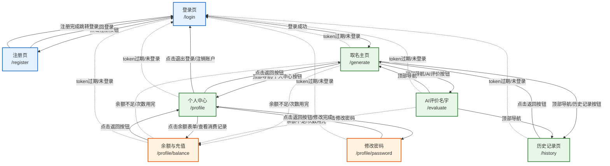


四、技术方案


设计流程

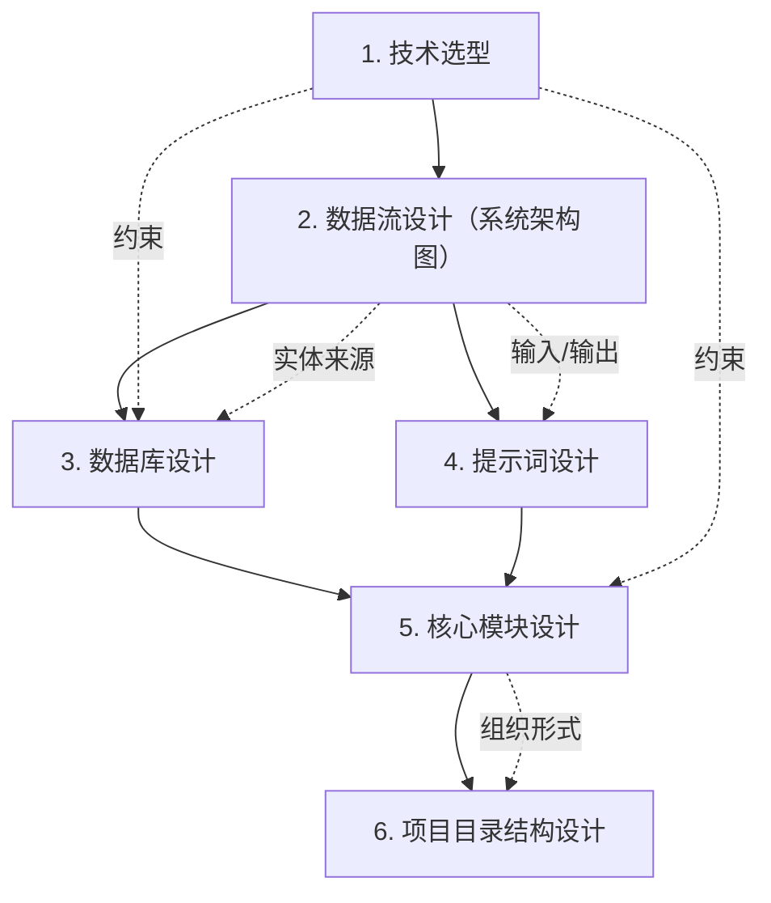


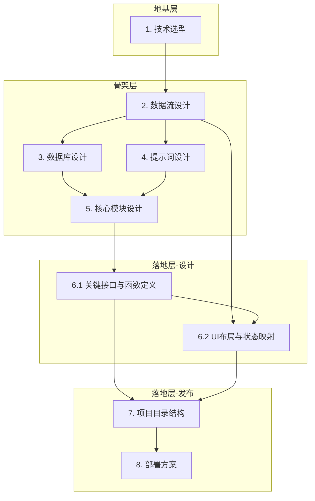


1.技术选型（选择什么技术）

| 技术层级         | 我的最终选型                 | 决策依据                                                     |
| :--------------- | :--------------------------- | :----------------------------------------------------------- |
| **开发语言**     | **Python 3.9+**              | 语法简洁，大模型生态（AI库）最成熟，项目代码量少，适合快速迭代。 |
| **前端界面**     | **Streamlit**                | **关键决策**：纯Python生成网页，无需学前端三件套。自带侧边栏(`st.sidebar`)和聊天组件(`st.chat_input`)，完美对应“左面板+右对话”设计。 |
| **大语言模型**   | **DeepSeek API**（在线）     | 注册即送500万tokens免费额度；中文取名逻辑稳定；API调用仅需3行代码。**不选本地模型**：因为需GPU显存≥6GB，学生电脑跑不动。 |
| **本地数据库**   | **SQLite**                   | Python内置`sqlite3`模块，**零配置、零安装**，一个文件就是一个库。适合项目初期练手SQL语句。 |
| **云数据库**     | **Supabase**                 | 老师明确推荐。提供免费500MB空间，带可视化后台管理界面，无需自己搭建云服务器。 |
| **会话状态管理** | **st.session_state**（内存） | Streamlit内置功能，一行代码存数据，不用额外安装Redis。项目关闭数据自动释放，足够MVP演示。 |
| **代码管理**     | **Git + GitHub**             | 防代码丢失，便于展示版本迭代过程（课程报告可截图提交记录）。 |

2.（这些技术怎么搭配干活）

​		1.数据流
（精简版）

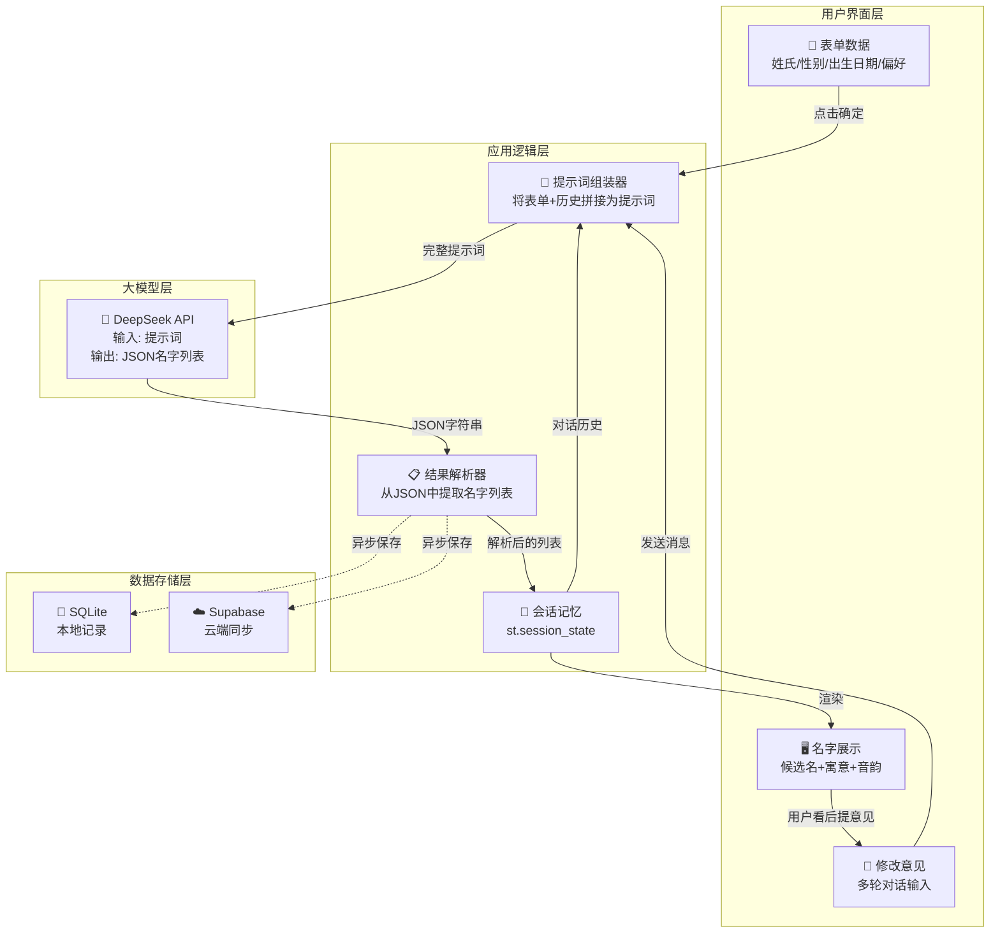

（详细版）

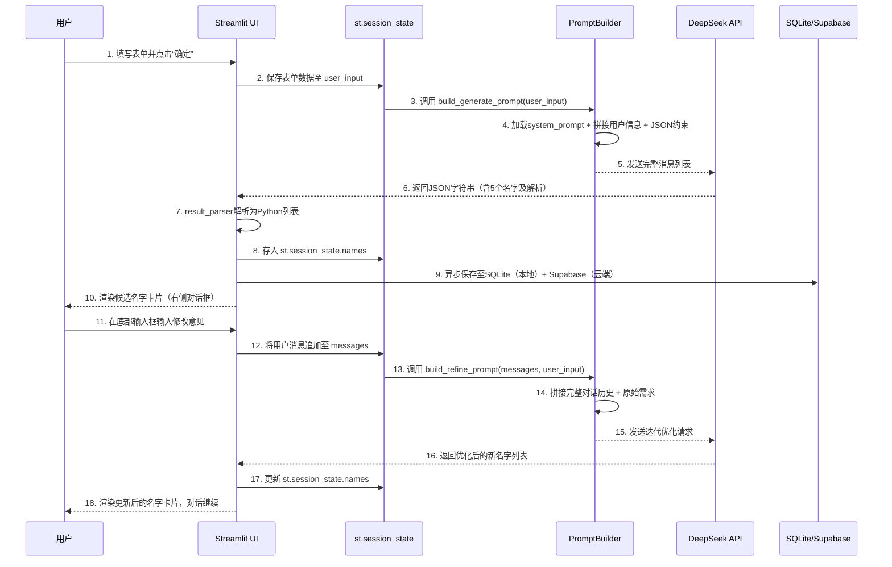

3.数据库设计（难度1）

本项目的数据库设计已从初步的3张表方案（NAMING_RECORDS + CHARACTER_USAGE + CLOUD_SYNC）
完善为更适合难度1~3的分表方案。

**难度1** 只需要3张核心表：

| 表名 | 作用 |
|:---|:---|
| `naming_sessions` | 记录每次取名会话的用户输入信息 |
| `candidate_names` | 记录AI生成的每个候选名字及解析 |
| `conversation_messages` | 记录用户和AI的多轮对话历史 |

详细的表结构、字段说明、DDL语句、Python操作代码 → 见 **[技术方案.md](./技术方案.md#二数据库设计)**

难度2/3需要的用户表、计费表等也在技术方案.md中有完整设计（后续扩展时使用）。

---

五、评价名字与打分功能

1.功能概述

用户在对AI生成的候选名字进行查看时，可以对每个名字进行个人评价和打分。打分采用五星制（1~5星），同时支持填写个性化备注（如"喜欢这个字"、"读音好听"等）。评分后，名字卡片上的评分状态会实时更新，并在历史记录页中支持按评分筛选查看。用户的评分和备注独立于AI生成的评分，属于用户个人的主观评价。

2.业务流程

评价流程从AI生成候选名字卡片开始。用户浏览名字列表，对感兴趣的名字点击评分区的星级按钮（1~5星），也可在备注输入框中填写对该名字的个人感受。每次评分或备注变更后，系统自动保存至数据库（Supabase），无需手动点击"保存"按钮。用户可随时修改评分或备注，以最后一次为准。

在历史记录页中，用户可通过评分筛选器（如"只看4星以上"）快速筛选出自己评价较高的名字。

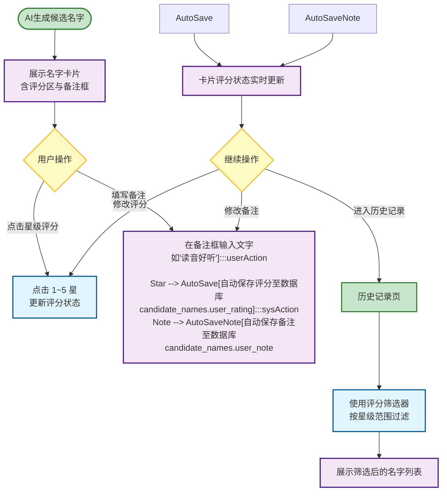

3.UI布局

```
一张高保真网页UI设计图，展示AI取名结果的候选名字卡片，每张卡片下方新增了"我的评价"区域。

卡片整体采用纯白背景、柔和阴影、圆角设计，与新中式风格一致。卡片主体展示名字（思源宋体大字）、字义解析、文化出处、五行属性等信息。

卡片底部新增"我的评价"区域，用浅灰分割线与上方信息区隔开。评价区左侧为五星评分控件，五颗星横向排列，空心星为灰色☆，实心星为金色★，用户悬停时高亮预选星级，点击后锁定评分。评分区右侧为备注输入框，占位符文字"写下你的评价…"，输入框窄而轻巧，不占过多空间。

已评分的卡片在评分区上方显示"⭐ 已评分"绿色小标签。整体风格为新中式美学，简洁清晰，评分区融入自然不突兀。
```

4.页面功能说明表

| 字段 | 说明 |
|:---|:---|
| **页面名称** | 取名主页（名字卡片评价区） |
| **路由** | `/generate` |
| **页面用途** | 用户对AI生成的候选名字进行评分和备注 |
| **主要组件** | 五星评分控件（可悬停预览）、备注输入框、已评分标签 |
| **可见条件** | AI生成名字后，每张名字卡片底部显示 |
| **关联状态** | 未评分态（空心星）、悬停预览态（高亮星级）、已评分态（锁定星级+绿色标签）、备注编辑态 |

| 字段 | 说明 |
|:---|:---|
| **页面名称** | 历史记录页（评分筛选） |
| **路由** | `/history` |
| **页面用途** | 按用户评分筛选历史名字 |
| **主要组件** | 评分筛选下拉框（全部/4星以上/3星以上等选项） |
| **可见条件** | 有历史记录时可用 |
| **关联状态** | 初始态（显示全部）、筛选态（显示过滤后的结果）、空结果态（无匹配记录） |

5.数据存储

用户评分和备注直接存储在 `candidate_names` 表中，新增两个字段：

| 字段 | 类型 | 说明 |
|:---|:---|:---|
| `user_rating` | INTEGER | 用户评分（1~5星），NULL表示未评分 |
| `user_note` | TEXT | 用户备注文字，NULL表示无备注 |

这样设计的原因：每个候选名字已经有一条独立的记录，评分和备注是这条记录的属性，直接加字段即可，无需新建表。查询时一次读取即可拿到名字所有信息（含评分和备注），减少数据库查询次数。

---

六、AI评价名字功能

1.功能概述

用户可以输入一个已有的名字（自己想的或朋友推荐的），让AI对该名字进行专业评价和打分。AI会从字义、音韵、文化出处、五行适配、寓意深度等多个维度进行综合评分，并给出详细的文字解析。每次评价消耗1次生成次数。

2.业务流程

用户登录后，通过顶部导航栏进入"AI评价名字"页面。页面中央为名字输入框，用户输入任意中文名字后点击"评价"按钮。系统首先校验次数余额是否充足，若不足则弹窗引导充值；若充足则扣除1次次数，调用大语言模型对名字进行多维度评析，结果以卡片形式展示。用户可连续输入不同名字进行评价，每次评价独立展示，互不覆盖。

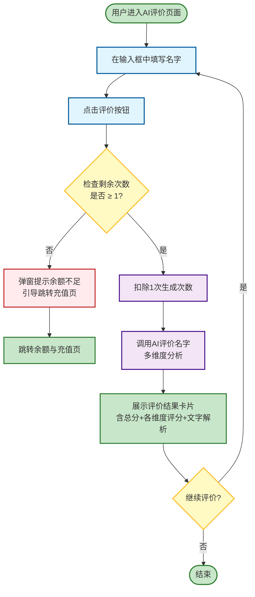

3.UI布局

```
一张高保真网页UI设计图，展示AI评价名字功能页面。

页面顶部为统一导航栏（品牌Logo + 取名主页/AI评价/历史记录/个人中心 + 余额 + 退出），"AI评价"为当前页高亮（朱砂红）。

主内容区域居中布局：
- 顶部标题"🤖 AI 评价名字"，下方灰色说明文字"输入一个名字，让AI为您深度解析"
- 名字输入框：大尺寸输入框，占位符"请输入要评价的名字，如：子轩"，右侧为朱砂红色"评价"按钮
- 下方为评价结果展示区域：
  - 初始态：显示引导图标和提示"输入名字后点击评价，AI将为您多维度分析"
  - 加载态：显示加载动画"🤔 AI 正在分析..."
  - 结果态：卡片展示，包含名字大字（衬线体）、总分圆环、各维度条形图（字义/音韵/文化/五行/寓意，每项0~100分）、AI综合评语

整体风格为新中式极简，暖白背景，纯白卡片，朱砂红+淡金点缀。
```

4.页面功能说明表

| 字段 | 说明 |
|:---|:---|
| **页面名称** | AI评价名字 |
| **路由** | `/evaluate` |
| **页面用途** | 用户输入名字，AI进行多维度评价和打分 |
| **主要组件** | 名字输入框、评价按钮、结果卡片（总分圆环+维度条形图+评语）、评价历史列表 |
| **可见条件** | 必须登录；若未登录，路由守卫自动跳转 `/login` |
| **关联状态** | 初始态（等待输入）、加载态（AI分析中）、成功态（展示评价结果）、异常态（余额不足/AI不可用） |

5.数据存储

评价记录存储在新表 `name_evaluations` 中：

| 字段 | 类型 | 说明 |
|:---|:---|:---|
| `id` | BIGSERIAL | 主键 |
| `user_id` | UUID | 关联用户 |
| `name_text` | TEXT | 被评价的名字 |
| `meaning_score` | INTEGER | 字义评分 0~100 |
| `sound_score` | INTEGER | 音韵评分 0~100 |
| `culture_score` | INTEGER | 文化评分 0~100 |
| `wuxing_score` | INTEGER | 五行评分 0~100 |
| `overall_score` | INTEGER | 综合评分 0~100 |
| `comment` | TEXT | AI综合评语 |
| `created_at` | TIMESTAMPTZ | 评价时间 |

每次评价独立存储，用户可在页面下方查看自己的评价历史。

