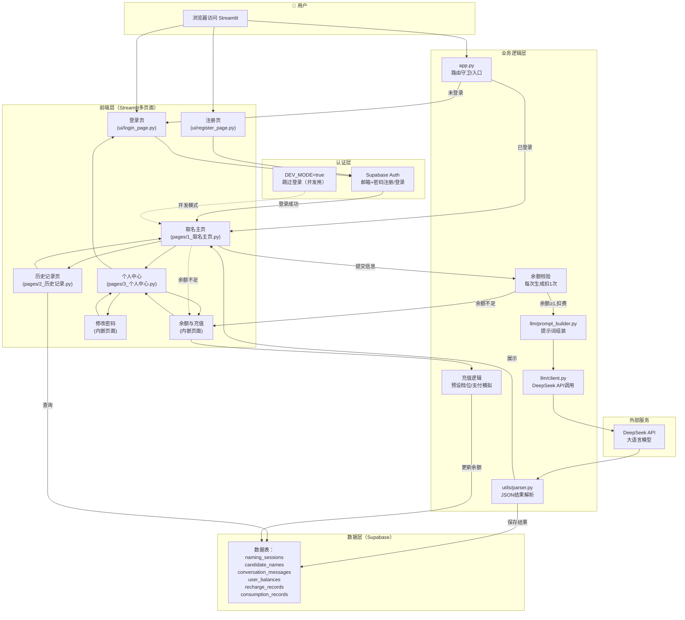
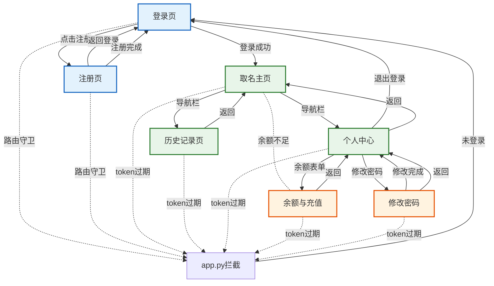
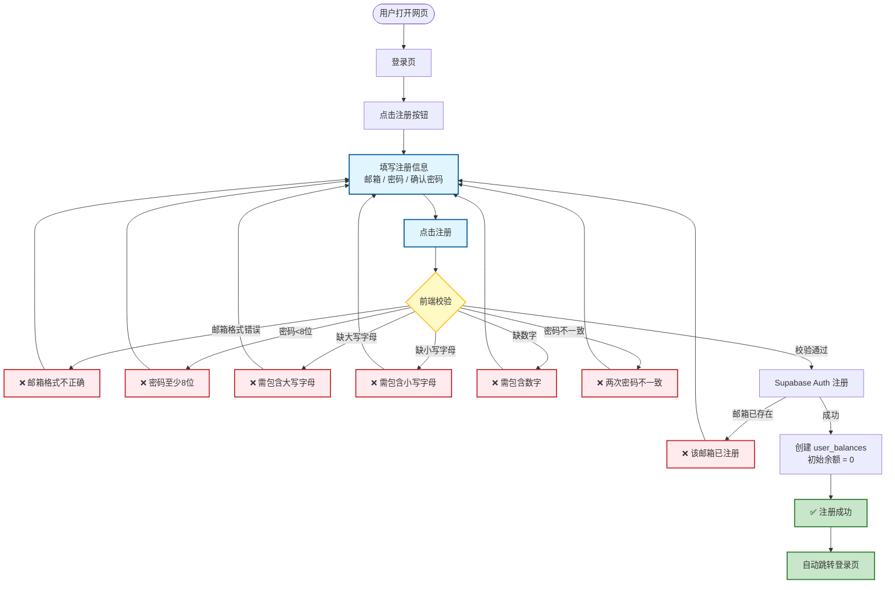
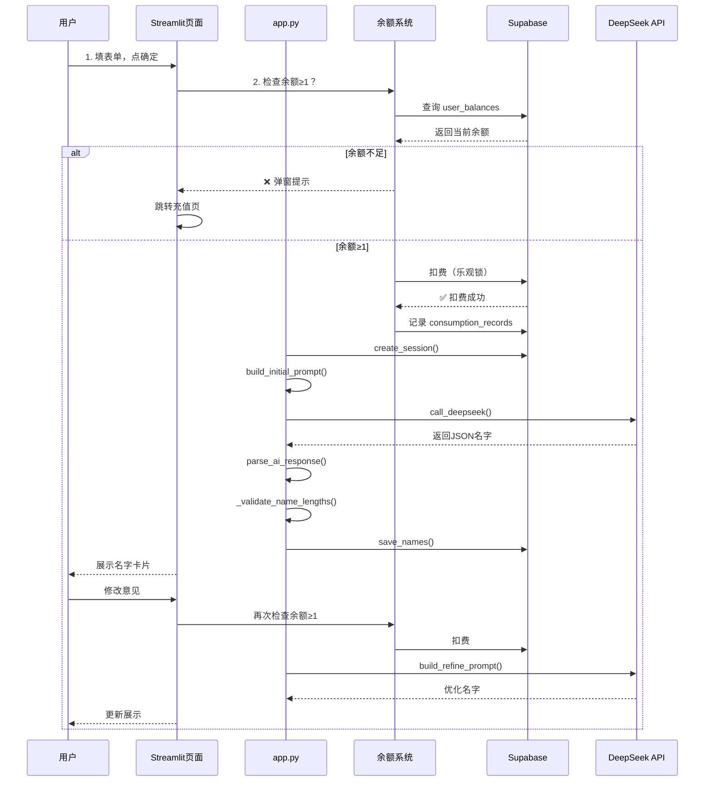
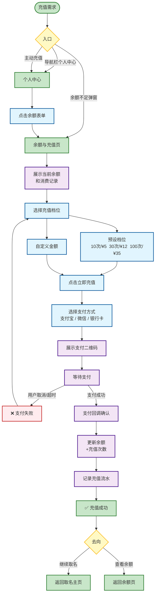
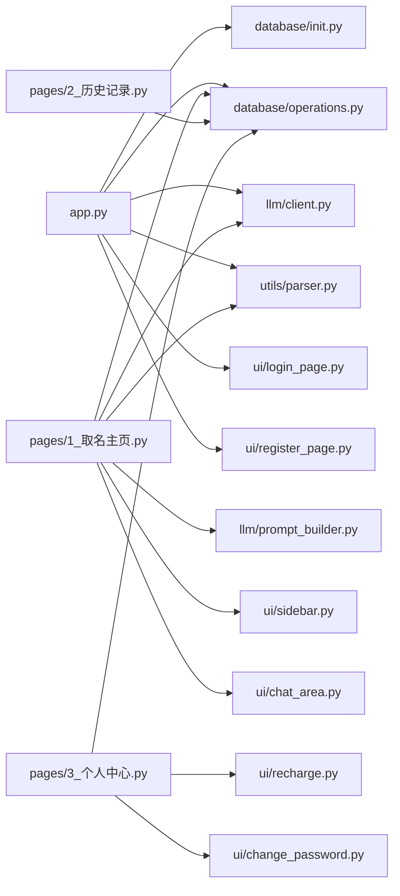

# 取名系统 - 项目流程图（v2.0）

## 整体架构



## 页面跳转逻辑（路由图）



## 注册流程（v2.0加强版）



## 取名业务流程（含计费）



## 充值流程



## 项目文件结构（v2.0）

```
goodname/
├── app.py                        # 路由守卫 + 登录/注册
├── pages/
│   ├── 1_取名主页.py              # 取名功能（含余额校验）
│   ├── 2_历史记录.py              # 历史记录（搜索/收藏）
│   └── 3_个人中心.py              # 个人中心（入口导航）
├── ui/
│   ├── login_page.py             # 登录表单
│   ├── register_page.py          # 注册表单（含密码强度）
│   ├── recharge.py               # 余额与充值
│   └── change_password.py        # 修改密码
├── database/
│   ├── init.py                   # Supabase 连接
│   └── operations.py             # 数据库操作
├── llm/
│   ├── client.py                 # DeepSeek API
│   └── prompt_builder.py         # 提示词组装
└── utils/
    └── parser.py                 # JSON 解析
```

## 文件依赖关系



## 各文件职责

| 文件 | 职责 | 涉及功能 |
|:---|:---|:---:|
| `app.py` | 路由守卫 + 登录/注册入口 | 登录态拦截、DEV_MODE |
| `pages/1_取名主页.py` | 取名功能 | 余额校验、提示词、名字展示 |
| `pages/2_历史记录.py` | 历史记录管理 | 搜索、收藏筛选 |
| `pages/3_个人中心.py` | 个人信息与入口 | 余额展示、导航跳转 |
| `ui/login_page.py` | 登录表单 | 邮箱+密码登录 |
| `ui/register_page.py` | 注册表单 | 密码强度校验、邮箱去重 |
| `ui/recharge.py` | 余额与充值 | 档位选择、支付模拟、消费记录 |
| `ui/change_password.py` | 修改密码 | 旧密码验证、新密码强度 |
| `database/init.py` | Supabase 连接 | 云数据库连接 |
| `database/operations.py` | 数据操作 | 含 get_user_balances/deduct/recharge |
| `llm/client.py` | DeepSeek API | API调用 |
| `llm/prompt_builder.py` | 提示词组装 | 字数约束、多轮优化 |
| `utils/parser.py` | JSON解析 | AI结果解析 |
